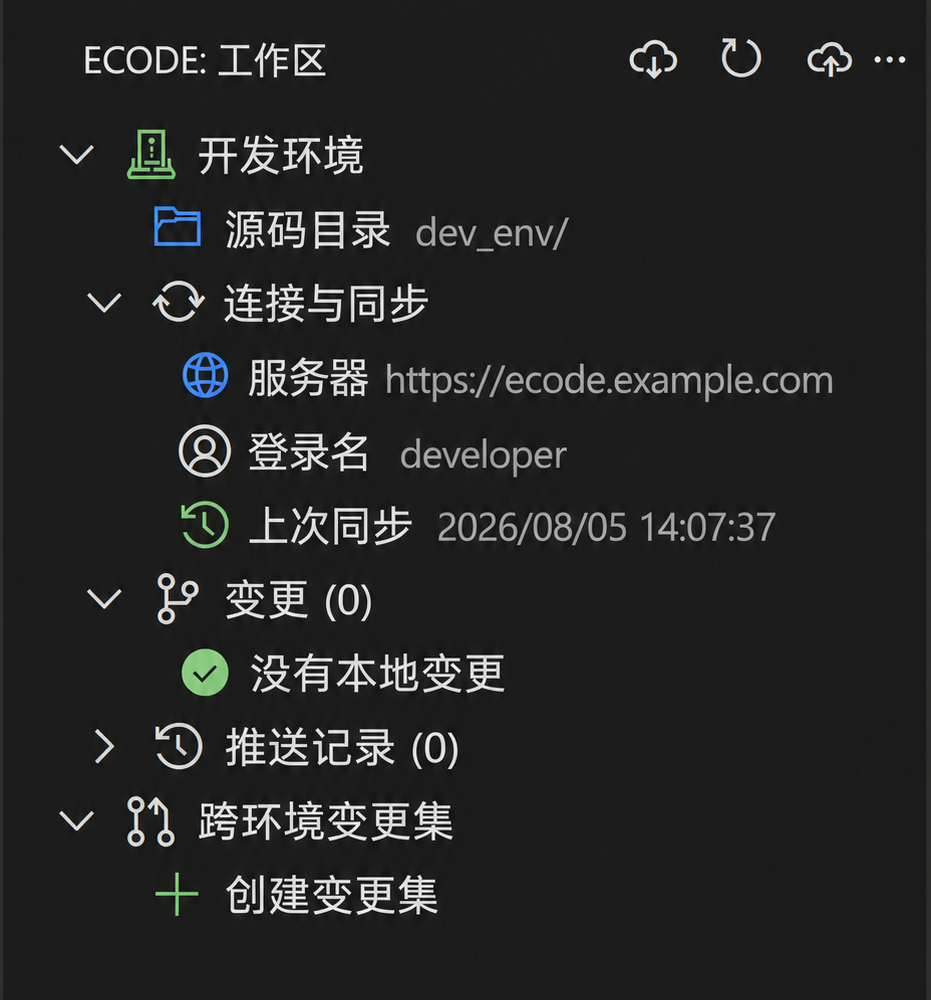

# Ecode Local

Ecode Local 是面向泛微 E-cology 9 Ecode 开发的 VS Code 扩展，用于在本地编辑源码、安全同步远端，并在多个环境之间传递变更。

## 主要功能

- 多环境隔离：每个环境拥有独立源码、连接和同步状态。
- 安全同步：拉取、差异预览、选择性推送、冲突保护和恢复副本。
- 跨环境变更集：将一次或多次推送整理为变更集，再应用到其他环境。
- Ecode 代码智能：提供 API、表单字段、`ecCom/antd` 组件的补全、悬停和跳转。
- AI Coding 支持：为通用 Agent 生成项目知识、操作 Skill 和 CLI。

*点击查看原图；示例中的环境和连接信息均为演示数据。*

## 安装

要求 VS Code 1.93 或更高版本，以及可访问的泛微 E-cology 9 Ecode 环境。

1. 从 [GitHub Releases](https://github.com/MrBear-xzx/ecode-local/releases) 下载 `.vsix`。
2. 在 VS Code 扩展视图的 `...` 菜单中选择“从 VSIX 安装”。
3. 安装后重新加载窗口，并核对版本号和 Release 中的 SHA-256。

## 快速开始

1. 打开一个工作区，在活动栏进入 **Ecode**。
2. 执行 `Ecode: 配置当前环境`，填写环境名称、目录、服务器地址和登录信息。
3. 连接测试通过后执行 `Ecode: 全量拉取`，建立本地源码和同步基线。
4. 在环境源码目录中编辑文件。
5. 执行 `Ecode: 刷新本地与远端变更`，检查状态和差异。
6. 执行 `Ecode: 选择并推送`，选择需要发布的文件。

每个新增环境都应先完成一次全量拉取。未建立同步基线的环境不能推送或应用变更集。

## 前置加载与文件夹发布

在 Ecode 侧边栏展开活动环境的“源码目录”即可操作生命周期状态：

- 分类用蓝色或灰色文件夹表示是否包含已发布根文件夹。
- 根文件夹用绿色或灰色包图标表示发布状态，并显示状态和前置加载顺序；内部文件夹不能单独发布。
- JS/CSS 文件可设置或取消前置加载；已前置加载文件显示 `P`，普通文件仍使用当前主题的原生图标和颜色。

发布、文件前置状态和顺序彼此独立；顺序越小越先执行，默认 `10000`。前置 JS/CSS 早于普通按需加载代码执行，使用前应确认影响范围。完整规则见[用户指南](docs/user-guide.md#前置加载与文件夹发布)。

“源码目录”先显示缓存再后台刷新，写操作仍使用实时状态。原生资源管理器不提供生命周期操作，只显示同步变更装饰：`A`、`M`、`D`、`!` 或 `↓`。

需要主动重读时，可从命令面板执行 `Ecode: 刷新源码结构与生命周期状态`。普通拉取、推送和跨环境变更集不会隐式改变发布、前置加载或顺序。

## 跨环境发布

1. 在来源环境完成推送。
2. 执行 `Ecode: 创建跨环境变更集`，选择相关推送记录。
3. 检查变更集中的文件和差异。
4. 切换到目标环境，执行“应用到当前环境”并确认。

变更集保存最终文件快照，不执行分支或逐行合并。Ecode 服务端不提供事务，网络或服务端异常可能导致部分文件成功；遇到这种情况可在排除问题后重新应用，扩展会继续处理未完成文件。

## 冲突与安全

- 拉取和推送不会静默覆盖本地与远端的并行修改；请在侧边栏选择接受远端，或手工合并后保留本地。
- 推送前会检查最新远端状态、JavaScript/JSX 编译结果和 GBK 可表示性，写入后会回读验证。
- 密码和 Cookie 存放在 VS Code `SecretStorage`，不会写入工作区或日志。
- `.ecode-local/` 包含同步状态、快照和恢复数据，不应提交到版本库。
- 删除环境会永久删除对应的本地源码、状态和本机凭据，但不会修改远端代码。

## 代码智能与 AI

完成全量拉取后，扩展可根据当前环境提供 Ecode API、表单字段、组件属性以及 `ecodeSDK.setCom/getCom` 的补全、悬停和跳转。

首次配置环境后，扩展还会生成 AI Coding 所需的知识文件、`ecode-local` Skill 和 Agent CLI。通用 Agent 可通过 `getLifecycleState` 读取生命周期状态，并在明确授权后设置文件前置加载、根文件夹前置加载顺序或文件夹发布；操作范围、参数及确认规则以生成的 Skill 为准。每次远端推送和生命周期写操作都需用户针对当前任务明确授权。

## 更多文档

- [详细使用指南](docs/user-guide.md)
- [开发与验证](docs/development.md)
- [更新日志](CHANGELOG.md)

当前支持 JavaScript、JSX、TypeScript 和 TSX；JavaScript/JSX 编译行为以 Ecode 使用的 Babel 7.5.5 为准。内置 API 与组件知识可能因 Ecology、KB 或组件版本不同而存在差异，请以目标环境和泛微官方文档为准。
